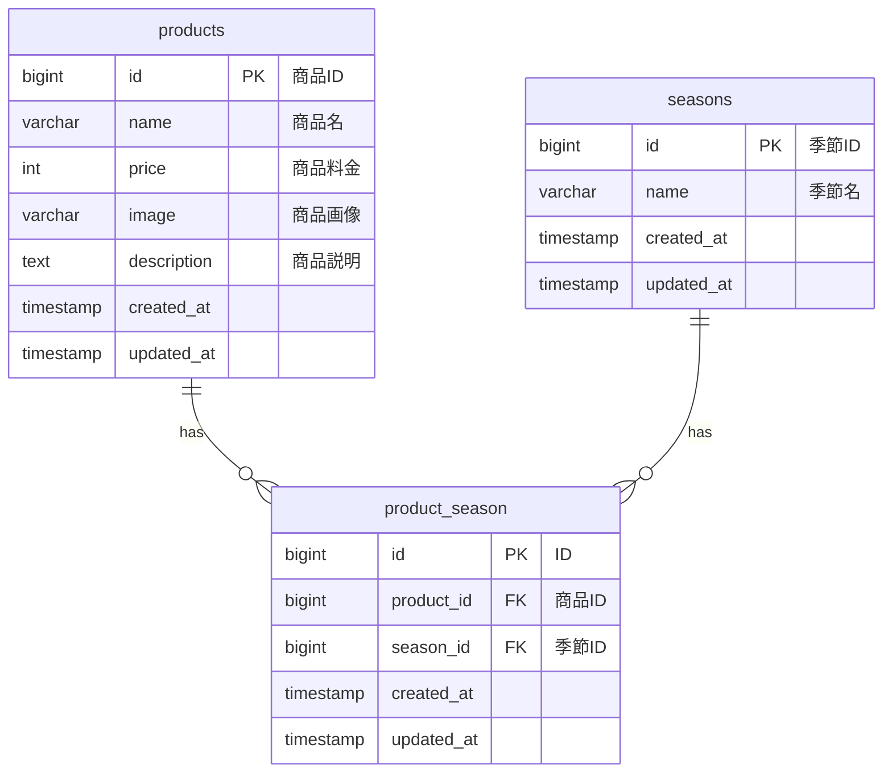

# アプリケーション名
商品管理システム「mogitate」

## 環境構築
1.  **リポジトリのクローン**
    ```bash
    git clone https://github.com/your-repository/mogitate-test.git
    cd mogitate-test
    ```

2.  **Dockerコンテナのビルドと起動**
    ```bash
    docker-compose up -d --build
    ```

3.  **Laravel依存パッケージのインストール**
    ```bash
    docker-compose exec php composer install
    ```

4.  **.envファイルの作成**
    `.env.example`をコピーして`.env`を作成します。
    ```bash
    cp src/.env.example src/.env
    ```

5.  **アプリケーションキーの生成**
    ```bash
    docker-compose exec php php /var/www/artisan key:generate
    ```

6.  **データベースのマイグレーションとシーディング**
    ```bash
    docker-compose exec php php /var/www/artisan migrate:fresh --seed
    ```
    
7. **ストレージリンクの作成**
   ```bash
   docker-compose exec php php /var/www/artisan storage:link
   ```

## 使用技術（実行環境）
-   **PHP**: 7.4.9
-   **Laravel Framework**: 8.83.29
-   **MySQL**: 8.0.26
-   **Nginx**: 1.21.1
-   **Docker**

## ER図


## URL
-   **開発環境**: [http://localhost/](http://localhost/)
-   **phpMyAdmin**: [http://localhost:8080/](http://localhost:8080/)

## 開発環境

- PHP 7.4.9
- Laravel 8.x
- MySQL 8.0.26
- Nginx 1.21.1

## 機能一覧

- 商品一覧表示
- 商品詳細表示
- 商品登録
- 商品更新
- 商品削除
- 商品検索
- 商品並び替え 